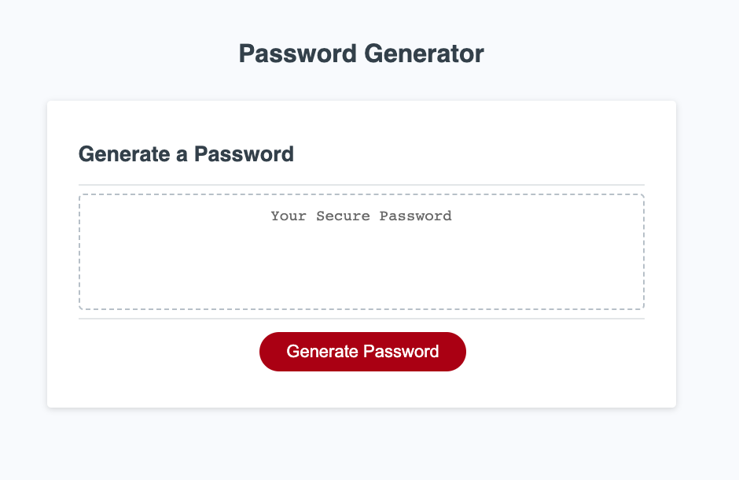
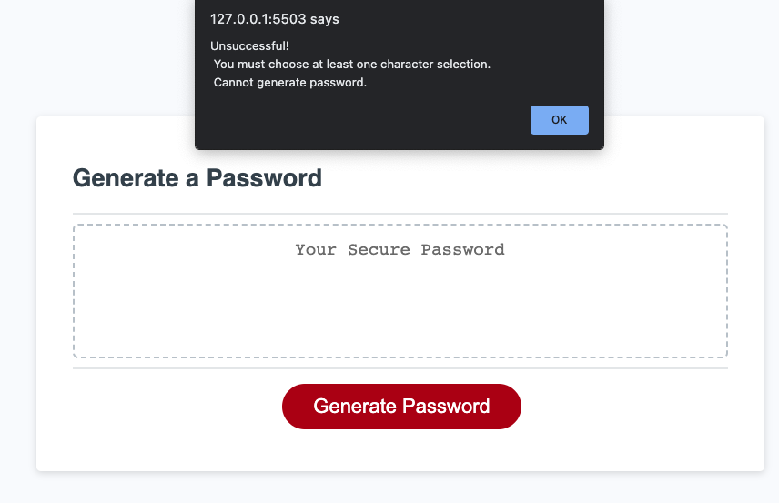

# password-fun-03

## Description

This webpage is used to auto generate a unique password.

## Usage

User will select what criteria they want in the password given options for length and character types such as lowercase, uppercase, number, and/or special characters.  The users will go through a series of prompts to make their criteria selections.  When all prompts are answered a password will be generated and displayed on the the page.

Select Password Length

If an invalid number is entered

Include numbers selection

Include lowercase letters selection

Include uppercase letters selection

Include special characters selection

Your generated password!!

If no character selection is made

## Installation
This webpage runs in the browser. No Installation or set up is required.
## Credits
 [@jesciak](https://github.com/jesciak/)

## Links
Github Repository:
https://github.com/jesciak/password-fun-03.git

Deployed Site:
